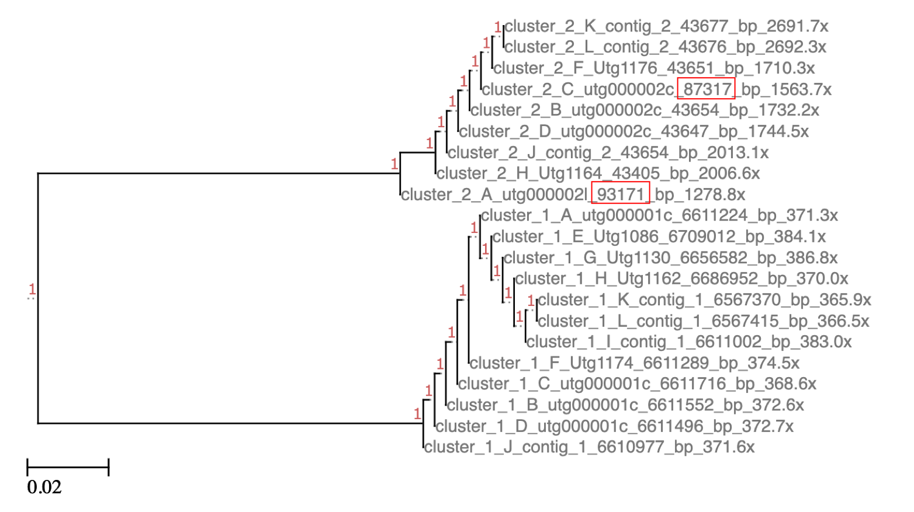

# Donut Falls

# Warning : What you currently see is under development. It is likely incomplete and incorrect. 

### (We're working on it.)


Named after the beautiful [Donut Falls](https://en.wikipedia.org/wiki/Doughnut_Falls)

Location: 40.630°N 111.655°W , 7,942 ft (2,421 m) elevation

More information about the trail leading up to this landmark can be found at [utah.com/hiking/donut-falls](https://utah.com/hiking/donut-falls)

Donut Falls is a [Nextflow](https://www.nextflow.io/) workflow developed by [@erinyoung](https://github.com/erinyoung) at the [Utah Public Health Laborotory](https://uphl.utah.gov/) for long-read [nanopore](https://nanoporetech.com) sequencing of microbial isolates. Built to work on linux-based operating systems. Additional config options are needed for cloud batch usage.

The heavy lifter of this workflow is [trycycler](https://github.com/rrwick/Trycycler), and many of the processes are **heavily inspired** by the [trycycler wiki](https://github.com/rrwick/Trycycler/wiki).

Donut Falls will also probably be a workflow of the [staphb-toolkit](https://github.com/StaPH-B/staphb_toolkit) once [@erinyoung]("https://github.com/erinyoung") gets around to it and all the containers are ready.

# Getting started

```
git clone https://github.com/UPHL-BioNGS/Donut_Falls.git
```

To make life easier, follow with

```
cd Donut_Falls
git init
```

so that `git pull` can be used for updates.

## Prior to starting the workflow

### Install dependencies
- [Nextflow](https://www.nextflow.io/docs/latest/getstarted.html)
   - Nextflow version 20+ is required (`nextflow -v` to check)
- [Singularity](https://singularity.lbl.gov/install-linux)

or
- [Docker](https://docs.docker.com/get-docker/) (*with the caveat that the creator and maintainer uses singularity and may not be able to troubleshoot all docker issues*)

It is highly recommended to use [bandage](https://rrwick.github.io/Bandage/) to visualize the assemblies, but this is optional. 

## The setup:

The default file structure for the MinKnow on a GridIon/MinIon with basecalling and demultiplexing is `<directory>/fastq_pass`. This workflow assumes **the end user** to be in that directory, but this can also be specified with `'params.fastq_pass'`.

<details>
   <summary>Initial File Tree with 12 barcodes</summary>

```
├── sample_key.csv    # optional file that connects a barcode to additional identifiers and (even more optional) paired-end Illumina reads
├── fast5_fail
│   ├── barcode01
│   ├── barcode02
│   ├── barcode03
│   ├── barcode04
│   ├── barcode05
│   ├── barcode06
│   ├── barcode07
│   ├── barcode08
│   ├── barcode09
│   ├── barcode10
│   ├── barcode11
│   ├── barcode12
│   └── unclassified
├── fast5_pass
│   ├── barcode01
│   ├── barcode02
│   ├── barcode03
│   ├── barcode04
│   ├── barcode05
│   ├── barcode06
│   ├── barcode07
│   ├── barcode08
│   ├── barcode09
│   ├── barcode10
│   ├── barcode11
│   ├── barcode12
│   └── unclassified
├── fastq_fail
│   ├── barcode01
│   ├── barcode02
│   ├── barcode03
│   ├── barcode04
│   ├── barcode05
│   ├── barcode06
│   ├── barcode07
│   ├── barcode08
│   ├── barcode09
│   ├── barcode10
│   ├── barcode11
│   ├── barcode12
│   └── unclassified
├── fastq_pass
│   ├── barcode01
│   ├── barcode02
│   ├── barcode03
│   ├── barcode04
│   ├── barcode05
│   ├── barcode06
│   ├── barcode07
│   ├── barcode08
│   ├── barcode09
│   ├── barcode10
│   ├── barcode11
│   ├── barcode12
│   └── unclassified
├── illumina_fastq
├── other_reports
```

</details>

# Usage for `Phase 1`

```
nextflow run Donut_Falls.nf -c configs/singularity.config
```

This workflow is meant to run in **TWO** phases. The first phase takes the multiple fastq files from the sequencing run and combines them into one file. If a `'sample key'` is supplied, the file will be renamed (more details on the sample key below). This fastq file is filtered with [filtlong](https://github.com/rrwick/Filtlong), split into groups by [trycycler](https://github.com/rrwick/Trycycler), and undergoes *de novo* alignment with three different aligners : [miniasm and minipolish](https://github.com/rrwick/Minipolish), [raven](https://github.com/lbcb-sci/raven), and [flye](https://github.com/fenderglass/Flye). Once the different assemblies have been completed, [trycycler](https://github.com/rrwick/Trycycler) clusters the resultant contigs. 

There is then a break in the workflow that requires manual input from the **End User**. The **End User** should look at the newick files in `donut_falls/trycycler_cluster/sample/contigs.newick`. This can be done multiple ways, but here I will suggest dragging and dropping the file into [ETE's Phylogenetic tree (newick) viewer](http://etetoolkit.org/treeview/). 

# Intermission : removing clusters and files

This is why [trycycler](https://github.com/rrwick/Trycycler) isn't a single workflow, and demonstrates how different assemblies can be, even when using the same starting material (albeit subsampled). If the **End User** tries to go to `phase 2` without manual inspection, `phase 2` will fail. I promise. I haven't sabotaged anything, it's just personal experience.

At this stage of the workflow, the nanopore reads have undergone four different assemblies from three different assemblers. In the ideal world, there would be a cluster for each chromosome and plasmid, and each cluster would have 12 contigs. This isn't always the case. Right now, reconciliation will occur on clusters that have at least 2 contigs. Additional stringency can be set by changing `params.trycycler_reconcile_minimum` to a higher number, with the understanding that clusters with less than this value will be removed from the final assembly. 

In the example I've included below, there is one chromosome (cluster 1) and a plasmid (cluster 2). The names of the tips are the `<cluster number> _ <contig name> _ <contig length> _ <coverage>`. The contig length is highlighted for two contigs in this example because they are drastically different than the others and will be removed before reconciliation. 


The **End User** must remove any clusters or individual contigs that do not appear to *cluster well*. This can be done by acutally removing the files and directory with `rm -rf` (or whatever tool the **End User** prefers) or they can just be moved out the way into a different directory. As for what is meant by *"clustering well"*, please read Trycycler's wiki at [https://github.com/rrwick/Trycycler/wiki/Clustering-contigs](https://github.com/rrwick/Trycycler/wiki/Clustering-contigs#choose-your-clusters) for a good definition and some great examples.

I recommend copying the final cluster directory to remove files, mostly because I horde files. The default value of `Phase 2` is to use `donut_falls/trycycler_cluster`, and the workflow will work perfectly fine when the **End User** removes files from that directory. If the **End User** chooses to use a different directory, like I'm going to recommend, the **End User** will need to adjust `params.cluster_directory` accordingly.

```
# create the new directory
mkdir -p clusters/failed

# copy of the directory with rsync to the new location
rsync -rvh donut_falls/trycycler_cluster clusters

# removing files with mv 
mv clusters/trycycler_cluster/2820899/cluster_002/1_contigs/C_utg000002c.fasta clusters/failed/2820899_C_utg000002c.fasta
mv clusters/trycycler_cluster/2820899/cluster_002/1_contigs/A_utg000002l.fasta clusters/failed/2820899_A_utg000002l.fasta
```

# Usage for `Phase 2`
Once the **End User** has manually inspected the contig clustering and removed abberant contigs and clusters, `phase 2` can begin. The initial directories for the filtered fastq files in `phase 1` are still required by the workflow, so the `-resume` paramater **must** now be included in the command or the workflow will start from the beginning (which is really annoying). The `params.phase2` must also be updated to `true` in a config file (`'params.phase2 = true'`) or on the command line as follows:

```
nextflow run Donut_Falls.nf -c configs/singularity.config -resume --phase2 true
```

If the **End User** has the cluster directory to a new location, `params.cluster_directory` must be specified accordingly in a config file or on the command line as follows:

```
nextflow run Donut_Falls.nf -c configs/singularity.config -resume --phase2 true --cluster_directory clusters/trycycler_cluster/
```

The second phase of the workflow takes the clusters that were generated in `phase 1` and [trycycler](https://github.com/rrwick/Trycycler) will reconcile differences between the assemblies, align them, parition the reads, and generate a consensus fasta. This fasta is then polished with [medaka](https://github.com/nanoporetech/medaka). [Trycycler](https://github.com/rrwick/Trycycler) will fail at the reconcile step if there is at least one contig or cluster that is causing problems. A dotplot at `donut_falls/trycycler_dotplot/sample/` should help the **End User** identify which contigs are creating issues. More information can be found in [trycycler's wiki](https://github.com/rrwick/Trycycler/wiki/Reconciling-contigs#dotplots). The problematic contigs can then be removed, and the workflow can be resumed just like before.

There are many different ways to fail at the `reconcile` step. When this step fails, [Nextflow](https://www.nextflow.io/) will give the **End User** an error that sometimes indicates why a sample failed. If not, the end user must look in the work directory that [Nextflow](https://www.nextflow.io/) has been working in (look for a `'Work dir:'` with a really long path near the end of the error message). The **End User** will need to go through the error file at `<work dir>/logs/trycycler_reconcile/sample.*.err`. 

# Usage for `Phase 2` if the **End User** have Illumina short-read sequencing for polishing

Optionally, `phase 2` can include *an extra polishing "step"* with Illumina paired-end short-read sequencing via [pilon](https://github.com/broadinstitute/pilon). This requires the `sample key` csv file (specify with `'params.sample_key'`), an associated parameter must be changed to true, `'params.illumina' = true`, and the directory with paired-end fastq files must be specified with `'params.illumina_fastq'` in a config file or on the command line as follows:

```
nextflow run Donut_Falls.nf -c configs/singularity.config -resume --phase2 true --illumina true --illumina_fastq illumina_fastq
```

Or like this with the new cluster directory:
```
nextflow run Donut_Falls.nf -c configs/singularity.config -resume --phase2 true --cluster_directory clusters/trycycler_cluster/ --illumina true --illumina_fastq illumina_fastq
```

This will add a quick QC step for the Illumina reads with [fastp](https://github.com/OpenGene/fastp), alignment with [bwa](http://bio-bwa.sourceforge.net/), sorting with [samtools](http://www.htslib.org/), and polishing with [pilon](https://github.com/broadinstitute/pilon) until no changes are being made during the polishing step.

# Examining sequences
In a perfect world, the **End User** now have a consensus sequence of complete genome of whatever the **End User** was sequencing. To check how well this was done, I recommend looking at the `X` file with [bandage](https://rrwick.github.io/Bandage/). This fasta sequence can now undergo any other bioinformatic process that a fasta file could go through: 
- Gene annotation with [Prokka](https://github.com/tseemann/prokka) or [PGAP](https://www.ncbi.nlm.nih.gov/genome/annotation_prok/) (and submission to NCBI!)
- Antimicrobial gene prediction with [AMRFinderPlus](https://github.com/ncbi/amr)
- Serotyping with tools with [SeqSero2](https://github.com/denglab/SeqSero2)
- And More!

# Creating the sample key
The `sample key` a csv file with the barcode in the first column, and the id in the second column. Common bioinformatic constraints apply. Do not include weird special characters or spaces in ids, and the ids must be unique. The `sample key` file is set with `'params.sample_key'`.

Example:
```
$ cat sample_key.csv 
#barcode,id
barcode01,2820899
barcode02,2788440
```

If the **End User** has Illumina paired-end files, the third column becomes the forward reads, and the fourth column is the reverse reads. The Illumina to nanopore sequences MUST be a 1:1 ratio. If the paired-end files can be used for more than one sample for the nanopore run, create a copy of the Illumina fastq reads with a slightly different name.

Example:
```
$ cat sample_key.csv 
#barcode,id,R1,R2
barcode01,2820899,2820899_R1.fastq.gz,2820899_R2.fastq.gz
barcode02,2788440,2788440_R1.fastq.gz,2788440_R2.fastq.gz
barcode03,2788440_A,2788440A_R1.fastq.gz,2788440A_R2.fastq.gz
```

## Donut Falls wouldn't be possible without:

- [trycycler](https://github.com/rrwick/Trycycler)
- [filtlong](https://github.com/rrwick/Filtlong)     - filter reads
- [flye](https://github.com/fenderglass/Flye)        - de novo assembly of long reads
- [miniasm](https://github.com/lh3/miniasm)          - de novo assembly of long reads
- [raven](https://github.com/lbcb-sci/raven)         - de novo assembly of long reads
- [any2fasta](https://github.com/tseemann/any2fasta) - convert gfa to fasta
- [medaka](https://github.com/nanoporetech/medaka)   - polisher with nanopore reads
- [pilon](http://www.htslib.org/)                    - polisher with Illumina reads
- [fastp](https://github.com/OpenGene/fastp)         - quick QC of Illumina reads
- [bwa](http://bio-bwa.sourceforge.net/)             - alignment of Illumina reads
- [samtools](http://www.htslib.org/)                 - sorts bam files generated by bwa

# Frequently Asked Questions (aka FAQ)
### What do I do if I encounter an error?

**TELL ME ABOUT IT!!!**
* [Github issue](https://github.com/UPHL-BioNGS/Donut_Falls/issues)
* [Email me](eriny@utah.gov)
* Send me a message on slack

Be sure to include the command used, what config file was used, and what the **nextflow** error was. 

### Where is an example config file?
There is a template file with all the variables [here](.configs/donut_falls_template.config) that the **End User** can copy and edit.

There's also a config file what we use here at UPHL [here](./configs/UPHL.config).

### How were raven, flye, and miniasm chosen for this workflow?
They perform _well_, their containers were easy to create, and they were all part of the [Trycycler walkthrough](https://github.com/rrwick/Trycycler/wiki/Clustering-contigs). 

I did attempt adding [canu](https://github.com/marbl/canu), but the assembly took forever for my tests. 

If the **End User** prefers other assemblers, please let me know and we'll work in some options. 

**Warning** : If there's not a relaible container of the suggested tool, I'll request the **End User** create a container for that tool and contribute to [StaPH-B's docker repositories](https://github.com/StaPH-B/docker-builds).

### What if I'm starting with fast5 files?
Then the **End User** needs to do basecalling and demultiplexing with [guppy](https://nanoporetech.com/nanopore-sequencing-data-analysis) first. 

Something like the following to get the fastq files.
```
# With config file
guppy_basecaller -i <input path> -s <save path> -c <config file> [options]
# With flowcell and kit name
guppy_basecaller -i <input path> -s <save path> --flowcell <flowcell name> --kit <kit name>
```

Something like the following to get the demultiplexed fastq files.
```
guppy_barcoder -i <input fastq path> -s <save path> --barcode_kits <kit name>
```

### What if I'm starting with a different file structure?
I do have a goal to make this more flexible as time goes on. For right now, the **End User** will need to adjust the file structure so that `'params.fastq_pass'` is a directory with `'barcode*/*fastq*'` files. 

```
├── directory
    ├── barcode01
    │    └── *.fastq or *.fastq.gz
    ├── barcode02
    │    └── *.fastq or *.fastq.gz
```

# Directed Acyclic Diagrams (DAG)
### Full workflow


